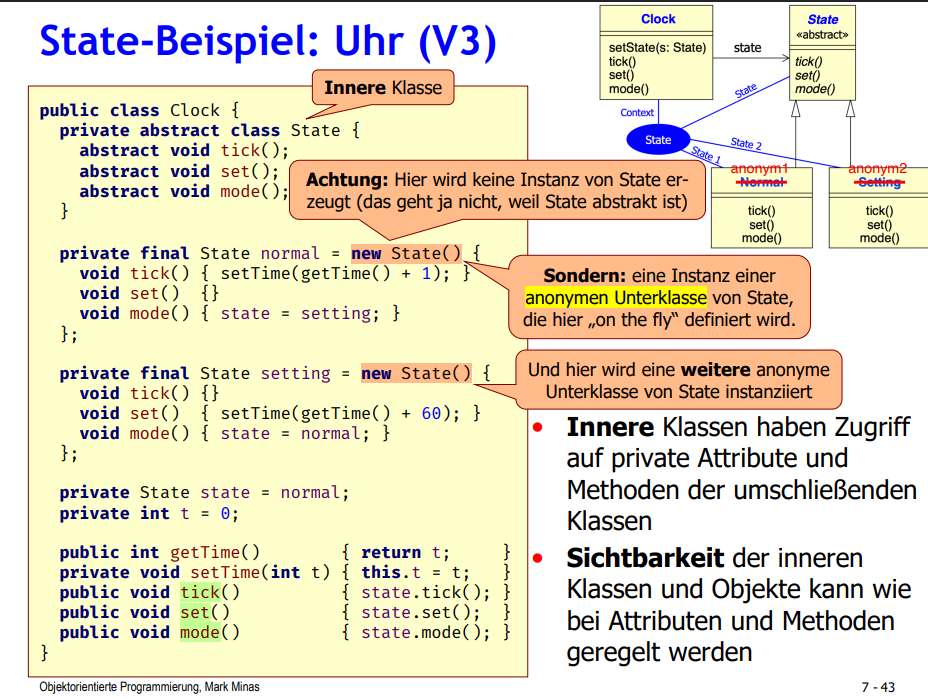

# 🃏 OOP-Klausur 2018FT – Schwarzer Peter & State Pattern

Dieses Projekt enthält eine strukturierte Umsetzung der Aufgaben aus der **OOP-Klausur 2018FT** an der Hochschule Fresenius. Ziel war es, ein Kartenspiel nach dem Prinzip von **Schwarzer Peter** zu modellieren und dabei das **State Pattern** korrekt einzusetzen.

## 📁 Projektstruktur

Der Java-Code ist in zwei Hauptbereiche unterteilt: Spielmodell & Tests.

```
2018FT/
├─ src/
│   ├─ Card.java                  // Einzelkarte mit Tierart & Geschlecht
│   ├─ CardFactory.java           // Kartendeck-Erzeugung inkl. Schwarzer Peter
│   ├─ Geschlecht.java            // Enum für MAENNLICH, WEIBLICH, DIVERS
│   ├─ Tierart.java               // Enum für Tierarten
│   ├─ Player.java                // Spieler mit Kartenhand
│   ├─ SchwarzerPeter.java        // Spiellogik & Kartenausgabe
│   └─ SchwarzerPeterAutomaton.java // Zustandsautomat mit State Pattern
└─ Test/
    ├─ CardTest.java
    ├─ PlayerTest.java
    ├─ GameSetupTest.java
    ├─ AutomatonTest.java
    └─ FullGameTest.java          // Kompletter Spielverlauf (Simulation)
```

## 🔄 Zustandsautomat (State Pattern)

Das Herzstück bildet `SchwarzerPeterAutomaton`, welches das **State Pattern** anwendet. 
Das Spiel kennt folgende Zustände:

- `PaareFinden`: Anfangsphase zum Entfernen aller Paare
- `KarteZiehen`: Spieler zieht verdeckt Karte vom linken Nachbarn
- `KarteGezogen`: Entscheidung, ob ein neues Paar entstanden ist
- `Spielende`: Nur noch ein Spieler mit Karte übrig

Jeder Zustand ist durch eine innere Klasse mit `entry()`- und Event-Methoden wie `select(p)`, `matching(p,x)`, `discard(p,x,y)` modelliert.

## ⚠️ Einschränkungen & Hinweise

Die Spielmechanik ist **nicht funktional**:

- Die States wechseln nicht richtig. 
- Ich hatte Probleme das Projekt in java zu übersetzen und das Konzept dahinter richtig zu verstehen
- Die Testklasse `FullGameTest` läuft zwar durch, kann aber in Endlosschleifen geraten

➡️ Trotzdem ist das State-Verhalten klar und modular nachvollziehbar.

## 🧪 Tests

Im Ordner `Test/` befinden sich **JUnit-5-Testklassen**, die zentrale Komponenten prüfen:

- `CardTest`: Gleichheit, String-Ausgabe, Validierung
- `PlayerTest`: Kartenlogik pro Spieler
- `GameSetupTest`: Kartenerzeugung und Verteilung
- `AutomatonTest`: Zustandsverhalten
- `FullGameTest`: Laufender Spielverlauf mit Konsolenausgaben (Debuggingzweck)

## 📐 UML-Diagramm

Zur Visualisierung des Zustandsautomaten befindet sich im Projekt die Datei `Statepattern.PNG`. Diese zeigt:

- Zustände und Übergänge
- Guard-Bedingungen und Aktionen

📷 

## 🧾 Fazit

Dieses Projekt eignet sich hervorragend zur **Veranschaulichung des State Patterns**. Obwohl das Spiel selbst nicht vollständig funktioniert, lassen sich anhand der Struktur und Tests zentrale OOP-Konzepte erkennen und nachvollziehen.

> 🔍 Ideal für alle, die das State Pattern anhand eines realitätsnahen Beispiels lernen oder prüfen möchten.

---

**Autor:** Cengiz  
**Modul:** Objektorientierte Programmierung (2018FT)
